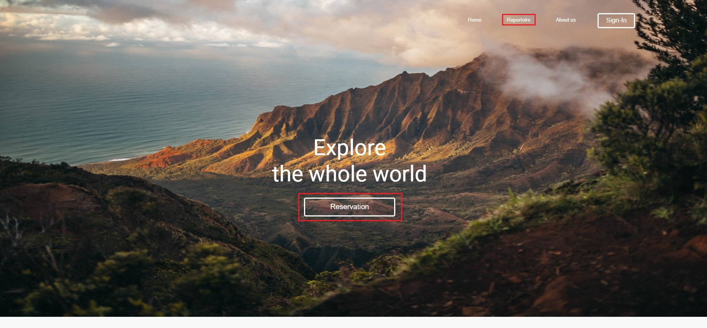
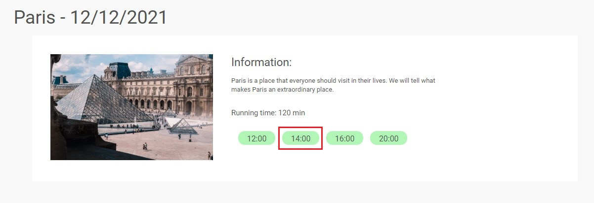
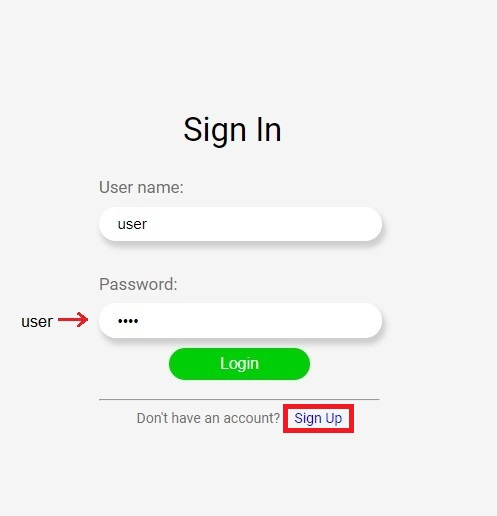
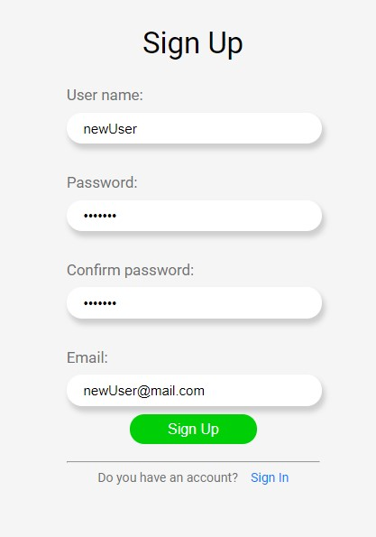
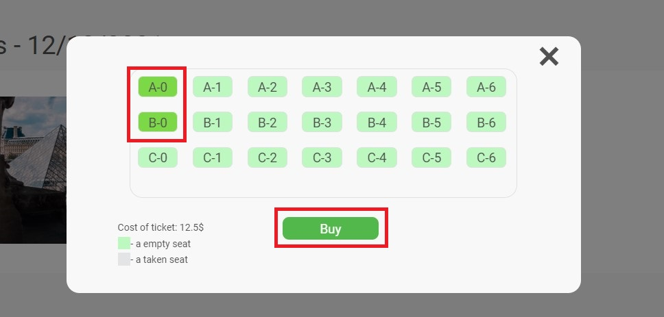
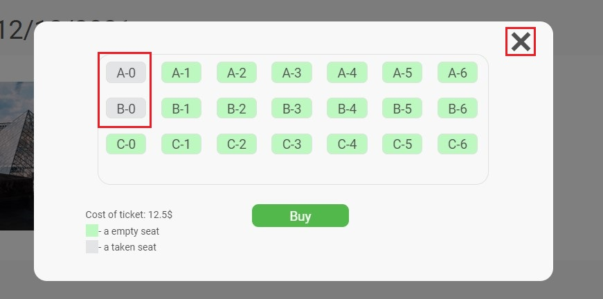
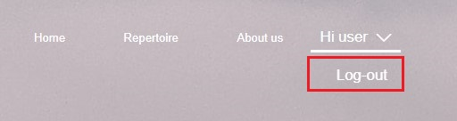
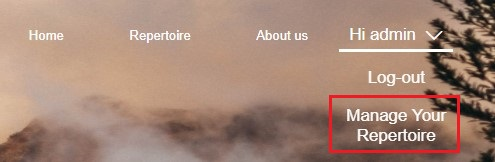
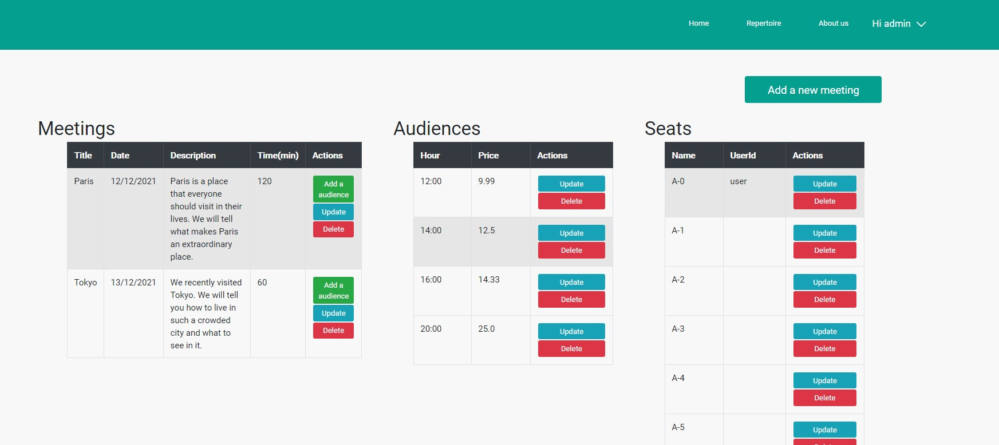

# TravelMeetingApp
>TravelMeeting Application is solved problem people who travel around the world and then they came back to them countries and they want to tell other about amazing places. This application is helped to organized a new one or modificated existing meeting in easy way. 

## Installation
First you have to open a project and find crate-db.sql file which is based in com.arkadiuszguzik.TravelMeeting.db package. Then you should create database using this file. In next step you have to update maven project to uploading nessecery libraries. After this process you can run TravelMeetingApplication.java file as Java Application. Next you can go to web browser and open localhost:8080 and you should be redirected to main web side of this application.

## Description
Starting with main side using 'Reservation' or 'Repertoire' button you can go to see planned meetings.

Then you can choose your meeting and hour by clicking on ona of green button.

If you are not logged you will be redirect to Sign In side. You can use existing account (User name: user, Password: user) or creating a new one by clicking Sing Up button.

 

Now if you click a button with hour on selected meeting you should see plan of audience. You can choose seats which you want buy and then confirm your choice by clicking 'Buy' button.

If you open one more time your choosed meeting you should noticed that your seats changed color and they are inactive.

Then let's logout and login on admin account (User name: admin, Password: admin). Now you can see 'Manage Your Repertoire' button. 

 

If you click it you will be redirected to manage side where you are able to create a new/update/delete a existing meetings, audiences and seats. In order to get access to seat you should choose apropriate meeting by clicking a row in meetings table and in the same way choose a audience. If there is not a button to add a new seat it means that limit has been reached (max 21 seats in one audiece).

